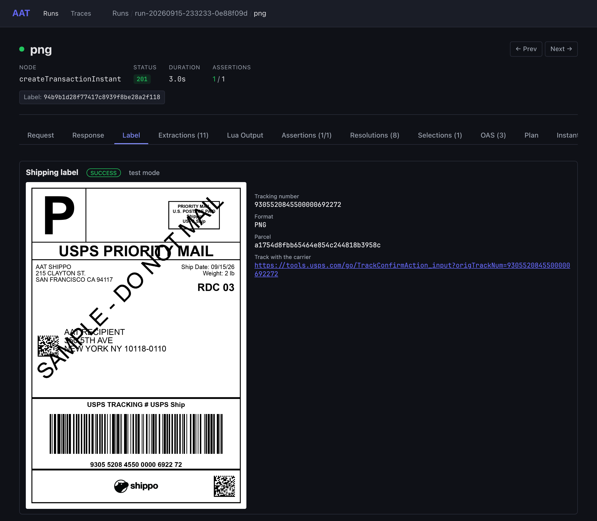
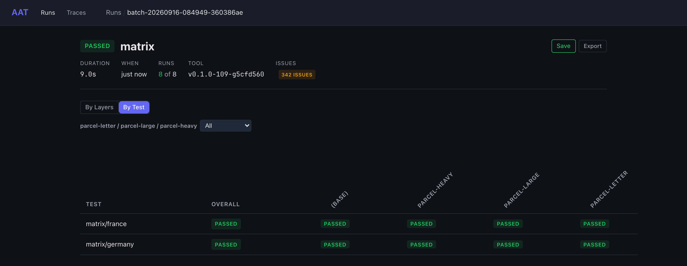
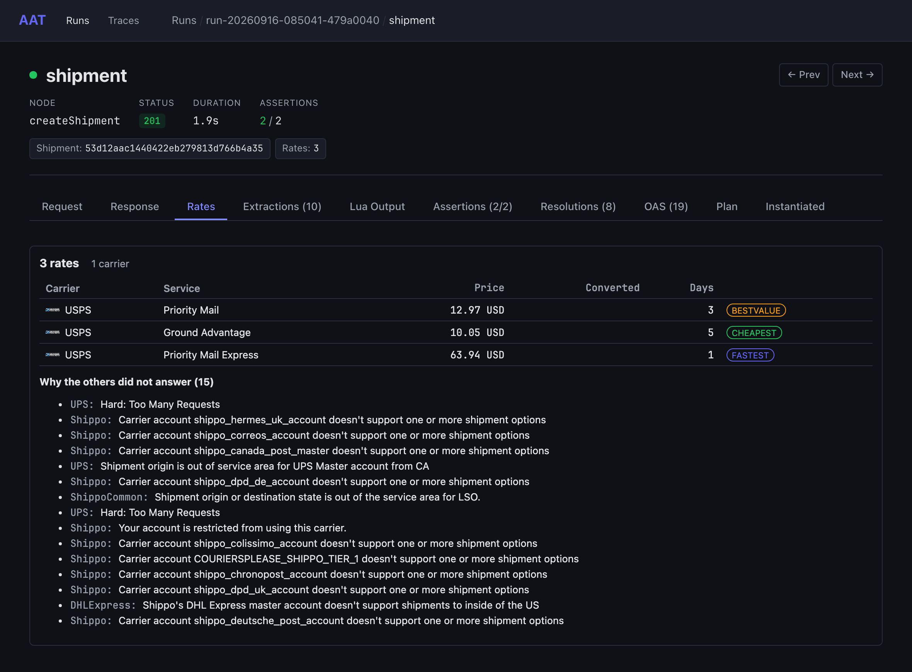

# aat-shippo

The [Shippo](https://goshippo.com) shipping API in test mode, as an [AAT](https://github.com/gburgyan/aat)
project. A graph describes each operation, plans chain them, and every plan runs against Shippo's live
test API. Everything this README says about Shippo came from those runs — where a run showed something
no plan asserts yet, it says so.

**Status:** carrier accounts, addresses, parcels, rating, and labels are done — 23 of Shippo's 70
operations, over 24 nodes, all run by 17 plans that pass together in about 90 seconds, plus a layer
matrix that crosses a lane with a parcel. Tracking, customs, batches and the account features are [not covered yet](#not-covered-yet).

```text
$ aat run plan labels/buy-and-refund

  [ 1/11] from (createAddress) 201  157ms  OAS: 3 warning(s)
          Address: e5225d1d49dc478c8af413ef7c948018
  [ 2/11] to (createAddress)   201  106ms  OAS: 3 warning(s)
          Address: cd8514d69f3144e4baa2761dac85af41
  [ 3/11] parcel               201  97ms  OAS: 6 warning(s)
          Parcel: f8edf53f5e0f402ba2ed7478d79bf2c0
  [ 4/11] shipment             201  592ms  OAS: 19 warning(s)
          Shipment: af71396ce19a452094c04e87328cd7a4
          Rates: 3
  [ 5/11] rates                200  69ms  OAS: 11 warning(s)
          Rates: 3
          Cheapest: 10.05
  [ 6/11] label                201  1.6s  OAS: 3 warning(s)
          Label: 37e364f5626a4b848853ee384627590e
  [ 7/11] read                 200  186ms  OAS: 3 warning(s)
          Status: SUCCESS
  [ 8/11] refund               201  541ms
          Refund: 941356f3da9d4b9aad11658e68de9f42
  [ 9/11] pending (getRefund)  200  92ms
          Status: PENDING
  [10/11] refunded             200  118ms  1 request  OAS: 3 warning(s)
          Status: REFUNDPENDING
  [11/11] refundListed         200  104ms  OAS: 1 warning(s)
          Refunds: 25

  cleanup:
    createRefund           skipped: released by refund (for label)

PASSED (11/11 steps, 3.6s)
OAS: 52 warning(s)
```

That run created two addresses and a parcel, rated the shipment, **bought a real USPS label in test
mode**, read it back, refunded it, and watched the label's own status follow. Every step checked what
it read — as in "the label is in test mode, tagged as ours, carries a tracking number, and the carrier
reported nothing". Cleanup would have refunded the label anyway; it found the plan had already done it.

The `OAS: n warning(s)` on each step is every place the response disagreed with Shippo's own published
spec. They are [the spec's bug, not the API's](#shippos-spec-says-nothing-is-nullable-and-the-api-sends-null-constantly),
which is why they are reported rather than fatal — and why they are counted rather than ignored.



That is the label Shippo actually returned, drawn in the web UI from its `label_url`.

---

## What this is for

Three things at once, and they are the same files.

**1. A test suite Shippo could run.** Every operation has a node and at least one plan that proves it
against the live test API. It is what you would keep in CI if you owned this API, or if you depended
on it.

**2. A Rosetta stone for integrating with Shippo.** The hard part of any API integration is not the
HTTP — it is knowing which calls come in which order, what each one really requires, and what the
documentation does not tell you. This package is that knowledge in a form you can execute:

- `graph.yaml` says what every operation takes and returns, **and what a run proved about it**, and
  [`docs/api/`](docs/api/) is that generated as a page per operation, with a diagram of how they wire
- `templates/` is one small file per operation with the exact request and the paths its outputs come from
- `plans/` is the call order for real tasks — rate and buy, buy in one call, refund, validate an address
- `domain.yaml` is 18 concepts, each naming the plans that prove it

Point a coding assistant at it and it has the whole workflow, not a pile of endpoint reference. That
is the difference between an API you can read about and an API you can ship against tomorrow.

**3. A demonstration of AAT.** This whole project is 1,213 lines of graph and 826 lines of templates —
against a 23,631-line OpenAPI spec. One file per operation, small enough to hold in your head or an
agent's context, and strictly validated before a single request goes out.

---

## Getting started

### What you need

- **AAT.** Install with Homebrew, a release archive, Docker, or `go install` — see
  [Install](https://gburgyan.github.io/aat/install/).
- **A Shippo test token.** Sign up at [goshippo.com](https://goshippo.com), take the
  `shippo_test_…` token from **Settings → API**, and export it:

  ```bash
  export SHIPPO_API_TOKEN=shippo_test_...
  ```

  A new account comes with 15 carrier accounts already active, so there is nothing else to set up.

### Run it

```bash
aat validate --strict                  # every file, template, plan, and OpenAPI reference; no requests sent
aat run plan labels/buy-and-refund     # the run above
aat run plan rating/rate-shop          # rate a shipment, read the cheapest rate on its own
aat run plan addresses/validate        # watch Shippo correct a misspelled address
aat run batch --env test-ci            # all 17 plans, paced, with the guards last
aat run batch matrix --env test-ci \
  --layer-group parcel-letter,parcel-large,parcel-heavy   # the matrix below
aat run show latest                    # what the last run sent and got back
aat web view latest                    # open it in the browser
```

The loop closes before anything is sent:


### Environments

| Environment | What it does |
|---|---|
| `test` (default) | `SHIPPO-API-VERSION: 2018-02-08`, the vendored spec's version, with OpenAPI findings **reported** on each step |
| `test-ci` | `test`, with request starts at least 1.2 s apart, for long batches under Shippo's test-mode limits |
| `test-strict` | `test`, with a response the spec disallows **failing** the step — see [the spec's own bug](#shippos-spec-says-nothing-is-nullable-and-the-api-sends-null-constantly) |
| `api-default` | No version header, so Shippo answers at the account's default API version |

---

## Nothing here can spend your money

This package buys shipping labels. That is the point, and it is also the risk, so:

- **Every node that creates something fails a response whose `test` is false.** A live token stops a
  plan at its first object instead of buying a real label.
- **Every object carries `metadata` starting `aat-shippo`,** so the guards can tell this package's
  objects from anything else on the account.
- **Cleanup refunds; it never deletes.** Almost nothing in Shippo can be deleted — addresses, parcels,
  shipments and orders are permanent — so every label node is paired with `createRefund` under
  `when: status == "SUCCESS"`. A refund is the only way to un-buy a label.
- **Two guards run last in every batch**, named `zz-` so they sort there:
  [`no-live-labels`](plans/zz-guard/no-live-labels.yaml) fails if any label on the account was bought
  with a live token, and [`no-unrefunded-labels`](plans/zz-guard/no-unrefunded-labels.yaml) fails if any
  label this package bought is still in `SUCCESS`, which means a cleanup did not run. Both also assert
  they found this package's labels at all, so neither can pass by finding nothing. Objects from other
  work on the same account are counted apart and never fail a guard.

In a full `aat run batch`, three plans buy four labels between them and the account ends with none of
them bought.

---

## Layers: one graph instead of a pile of collections

This is the part worth stealing.

A *layer* is a few lines of YAML that change one node's inputs. A *layer group* crosses them. The
plans in `matrix/` pin their lane and say nothing about the parcel, so every parcel layer reaches them:

```yaml
# layers/parcel-letter.yaml
name: parcel-letter
description: A 22 x 11 x 1 cm letter weighing 15 g.
inputs:
  createParcel.length: "22"
  createParcel.width: "11"
  createParcel.height: "1"
  createParcel.distanceUnit: cm
  createParcel.weight: "15"
  createParcel.massUnit: g
```

```bash
aat run batch matrix --env test-ci \
  --layer-group parcel-letter,parcel-large,parcel-heavy
```


Two plan files. One command. Eight runs, deduplicated, with a matrix view:



**And the answers are not the same.** The parcel does not just change the price — it changes *which
carriers will quote at all*:

| Lane | Parcel | Rates | Carriers |
|---|---|---:|---|
| France, Paris → Lyon | (the default box) | 2 | Colissimo |
| France, Paris → Lyon | `parcel-letter` | 2 | Colissimo |
| France, Paris → Lyon | **`parcel-large`** | **6** | **Chronopost**, Colissimo |
| France, Paris → Lyon | **`parcel-heavy`** | **6** | **Chronopost**, Colissimo |
| Germany, Berlin → Munich | (the default box) | 1 | DPD DE |
| Germany, Berlin → Munich | `parcel-large` | 1 | DPD DE |
| Germany, Berlin → Munich | `parcel-heavy` | 1 | DPD DE |
| Germany, Berlin → Munich | **`parcel-letter`** | **2** | DPD DE, **Deutsche Post** |

France gains Chronopost once the box is long enough for its 21 cm minimum. Germany gains Deutsche Post
once the parcel is light enough for a letter product — a *Kompaktbrief* at 1.10 EUR, against 4.85 EUR
for the same route by parcel. The same axis moves two lanes in opposite directions, and finding that out
cost one command.

Every layer sets inputs of `createParcel` and of nothing else, so a plan that pins its own parcel is
immune and any plan that does not can be crossed with all of them.

---

## When a carrier says no, it says why

A carrier that cannot serve a shipment does not fail the request. Shippo answers `201` with fewer rates
and a `messages` array. AAT's rates visualizer shows both halves:



That panel is why no plan here asserts that a particular carrier answered unless it pinned that carrier.
It is also the single most useful thing to know when integrating: **your rate shop returning three
options instead of eleven is usually not a bug**, and the reason is right there.

---

## What Shippo does in test mode

Everything in this section is something a run found. Each item names the plan that pins it.

### A 201 does not mean a label was bought

Buying a UPS rate answers **`201` with `status: ERROR`** and:

```text
The UPS account is not yet registered. Please register via webapp at
https://apps.goshippo.com/settings/carriers by clicking on "Activate Account" for UPS.
```

Rating and buying are separate permissions. UPS quotes a US domestic lane, is often the cheapest — and
cannot sell you the label. **The status, not the HTTP code, is what says a label exists.** Every label
plan here pins USPS for that reason — [labels/buy-and-refund](plans/labels/buy-and-refund.yaml).

### Validating an address rewrites it, and drops your metadata

`validate: true` on a create corrects the address in place:

| Sent | Returned |
|---|---|
| `1 Market Stret` | `1 Market St` |
| `San Fransisco` | `San Francisco` |
| `94105` | `94105-1420` |

…and comes back with **`metadata: ""`**. A validated address cannot carry your tag. The other way,
`GET /addresses/{id}/validate`, answers a **new address object with its own `object_id`** rather than
the one you validated. A valid address can still carry advice: `is_valid: true` with a *Default Match*
message asking for an apartment number — [addresses/validate](plans/addresses/validate.yaml).

### Shippo does not tell you what format your label is

`label_file_type` chooses the format, and the transaction **does not echo it back**. The only way to
know what you got is the label URL's extension. This package exposes `labelFormat`, parsed from the
URL, rather than the type that was asked for — [labels/formats](plans/labels/formats.yaml).

### A refund does not settle, but the label reacts at once

The refund runs `QUEUED → PENDING → SUCCESS | ERROR` and stays `PENDING` for a long time — at least 90
seconds in our measurements, which is what a carrier taking days to accept a refund looks like through
an API. The **label's** own status becomes `REFUNDPENDING` immediately, so that is what to wait on —
[labels/buy-and-refund](plans/labels/buy-and-refund.yaml).

### Rating is documented as asynchronous and behaves synchronously

The shipment carries a `QUEUED / WAITING / SUCCESS / ERROR` status for rating. In test mode every lane
we probed answered `SUCCESS` with its rates already attached, so a poll settles on its first read. The
plans poll anyway, because that is what the API asks for and a slower lane would need it —
[rating/rate-shop](plans/rating/rate-shop.yaml).

### Reading one carrier account tells you less than listing them

`GET /carrier_accounts/{id}` leaves `service_levels` out of the body entirely. The listing with
`service_levels=true` is the only way to see them — [carriers/accounts](plans/carriers/accounts.yaml).

### `GET /refunds/` needs its trailing slash

And the spec declares **no `page` or `results` parameters** for it, alone among the listings, even
though the response pages.

### Shippo's spec says nothing is nullable, and the API sends `null` constantly

`next` and `previous` on every list, `is_residential`, `latitude` and `longitude` on an address, and
`template` on a parcel. Under strict OpenAPI validation every list read in this package would fail for
a reason that is the spec's, not the caller's:

```text
$.next: got null, want string
$.previous: got null, want string
```

So the environments validate in `auto` — every request and response is still checked and every finding
recorded on the step's OAS tab — and [drift/nullable-pagination](drift/nullable-pagination.yaml) pins
it. Run it either way:

```bash
aat run plan drift/nullable-pagination.yaml                    # passes; the finding is recorded
aat run plan drift/nullable-pagination.yaml --env test-strict  # fails, on Shippo's own spec
```

### The carrier grid

15 carrier accounts come active on a test token, and **10 of them will actually quote**. FedEx is
restricted on the account, Canada Post has a credential mismatch, LSO is Texas-only, and CouriersPlease
answers nothing even once you supply the company name it asks for — which makes Australia a lane this
package cannot use. The full grid, with the reason each silent carrier gives, is in
[docs/carrier-lane-coverage.md](docs/carrier-lane-coverage.md).

Test-mode rate limits, per minute: **50** POSTs, **400** single GETs, **10** list GETs, **10** batch
POSTs. The list limit is the binding one, which is why `test-ci` paces requests and list steps retry on
429. Separately, *(probe — observed, not asserted)* UPS rate-limits itself under a fast batch and
simply returns no rates.

---

## How the plans fit together


```
carriers/      what the token can ship with, and the parcel templates carriers publish
addresses/     create, read, list, and both ways of validating
parcels/       by dimensions, and from a carrier's template token
rating/        shipments, rate shopping, and the same rates in another currency
labels/        the two-step purchase, the one-call Instalabel, formats, and refunds
matrix/        lanes with nothing said about the parcel, for the layer groups to cross
zz-guard/      run last: no live labels, and nothing bought and left unrefunded
drift/         outside plans/, so a batch never runs it: what the spec gets wrong
```

---

## What's exercised

Every operation below has a node and at least one passing plan.

| Shippo operation | Node | Proven by |
|---|---|---|
| `ListCarrierAccounts` | `listCarrierAccounts` | [carriers/accounts](plans/carriers/accounts.yaml), [labels/instalabel](plans/labels/instalabel.yaml), [drift/nullable-pagination](drift/nullable-pagination.yaml) |
| `GetCarrierAccount` | `getCarrierAccount` | [carriers/accounts](plans/carriers/accounts.yaml) |
| `ListCarrierParcelTemplates` | `listCarrierParcelTemplates` | [carriers/parcel-templates](plans/carriers/parcel-templates.yaml) |
| `GetCarrierParcelTemplate` | `getCarrierParcelTemplate` | [carriers/parcel-templates](plans/carriers/parcel-templates.yaml), [parcels/from-template](plans/parcels/from-template.yaml) |
| `CreateAddress` | `createAddress` | [addresses/create-and-read](plans/addresses/create-and-read.yaml), [addresses/validate](plans/addresses/validate.yaml), [addresses/international](plans/addresses/international.yaml) |
| `GetAddress` | `getAddress` | [addresses/create-and-read](plans/addresses/create-and-read.yaml) |
| `ListAddresses` | `listAddresses` | [addresses/create-and-read](plans/addresses/create-and-read.yaml) |
| `ValidateAddress` | `validateAddress` | [addresses/validate](plans/addresses/validate.yaml) |
| `CreateParcel` | `createParcel` | [parcels/create-and-read](plans/parcels/create-and-read.yaml), [parcels/from-template](plans/parcels/from-template.yaml) |
| `GetParcel` | `getParcel` | [parcels/create-and-read](plans/parcels/create-and-read.yaml) |
| `ListParcels` | `listParcels` | [parcels/create-and-read](plans/parcels/create-and-read.yaml) |
| `CreateShipment` | `createShipment` | [rating/rate-shop](plans/rating/rate-shop.yaml), [matrix/france](plans/matrix/france.yaml), [matrix/germany](plans/matrix/germany.yaml) |
| `GetShipment` | `getShipment` | [rating/rate-shop](plans/rating/rate-shop.yaml) |
| `ListShipments` | `listShipments` | [rating/shipment-listing](plans/rating/shipment-listing.yaml) |
| `ListShipmentRates` | `listShipmentRates` | [rating/rate-shop](plans/rating/rate-shop.yaml) |
| `ListShipmentRatesByCurrencyCode` | `listShipmentRatesByCurrency` | [rating/currencies](plans/rating/currencies.yaml) |
| `GetRate` | `getRate` | [rating/rate-shop](plans/rating/rate-shop.yaml) |
| `CreateTransaction` (from a rate) | `createTransaction` | [labels/buy-and-refund](plans/labels/buy-and-refund.yaml) |
| `CreateTransaction` (Instalabel) | `createTransactionInstant` | [labels/instalabel](plans/labels/instalabel.yaml), [labels/formats](plans/labels/formats.yaml) |
| `GetTransaction` | `getTransaction` | [labels/buy-and-refund](plans/labels/buy-and-refund.yaml) |
| `ListTransactions` | `listTransactions` | [zz-guard/no-live-labels](plans/zz-guard/no-live-labels.yaml), [zz-guard/no-unrefunded-labels](plans/zz-guard/no-unrefunded-labels.yaml) |
| `CreateRefund` | `createRefund` | [labels/buy-and-refund](plans/labels/buy-and-refund.yaml), and every label node's cleanup |
| `GetRefund` | `getRefund` | [labels/buy-and-refund](plans/labels/buy-and-refund.yaml) |
| `ListRefunds` | `listRefunds` | [labels/buy-and-refund](plans/labels/buy-and-refund.yaml) |

---

## AAT features on display

| Feature | Where |
|---|---|
| **Layers and layer groups** | Three parcel layers crossed with two lanes, deduplicated, in one command |
| **Runtime OpenAPI validation** | Every request and response checked against Shippo's own spec; `test-strict` turns findings into failures |
| **Cleanup pairings** | `createTransaction → createRefund` with `when: status == "SUCCESS"`, released when a plan refunds for itself |
| **Guards** | Two `zz-` plans that page the whole account and can't pass by finding nothing |
| **`repeat`** | Polling on a status (`until`) and paging a listing (`next`), both in the guards and the label plans |
| **Lua transforms** | Counting a page's own objects, deriving a label's real format from its URL, turning a rate list into cheapest/fastest |
| **Visualizers** | Two HTML files, six registrations: the rates table and the rendered label |
| **Archives** | Every request and response kept, with the token redacted; `aat run show`, Copy as cURL, and the web UI |
| **Strict decoding** | An unknown key in any project file is an error naming the line and the nearest valid key |
| **Environments** | One chain, four runnable environments, differing only in the version header and how strict validation is |

---

## What we sent upstream

Building this package found five gaps in AAT itself. Every one is fixed and merged, each with tests
that fail without it:

| PR | What it was |
|---|---|
| [#28](https://github.com/gburgyan/aat/pull/28) | An `apikey` auth can write its own scheme — `Authorization: ShippoToken <key>` — without the scheme becoming part of the secret |
| [#29](https://github.com/gburgyan/aat/pull/29) | A block key may end in `[]`. **`aat generate`'s own output failed `aat validate --strict`** for any spec with an array query parameter |
| [#30](https://github.com/gburgyan/aat/pull/30) | The static OpenAPI check reads a `oneOf`/`anyOf` request body. The six bodies the generator declines to write were exactly the six that then warned |
| [#31](https://github.com/gburgyan/aat/pull/31) | An input can be named for the package rather than the JSON body — form, query and path inputs already could |
| [#32](https://github.com/gburgyan/aat/pull/32) | An input can name a property nested inside the request body, which a template routinely flattens into one input per leaf |

Three of the five were only findable this way. `aat generate` scaffolds a project from a spec, and on
Shippo's spec its own output failed its own validator — nothing catches that but pointing the tool at a
real API and running what comes out.

---

## The spec

`openapi/public-api.yaml` is Shippo's published spec, vendored verbatim from
`https://docs.goshippo.com/spec/shippoapi/public-api.yaml`, fetched 2026-09-15. Shippo publishes no
git-pinnable revision, so the pin is the date, the digest, and the version the file declares:
OpenAPI 3.1.0, `info.version` `2018-02-08`, 939,721 bytes, SHA-256
`840802c43c1676d64d534a466812acf0321eccc0f1df5471cd4fd9c6ae19dbcc`. Two fetches twelve minutes apart
were byte-identical.

Pinning both the spec and the `SHIPPO-API-VERSION` header is what makes validation mean something: the
API answers at the version the spec describes, so a mismatch is a real difference rather than version
skew.

---

## Shippo already has an MCP server. This is not that.

Shippo ships a hosted MCP server at `mcp.shippo.com` and
[agent skills](https://github.com/goshippo/ai), and they are good. Theirs lets an assistant *ship a
package for you*. This lets an assistant *build and keep your integration* — and prove tomorrow that it
still works. The overlap is real and worth saying out loud.

---

## Not covered yet

Tracking and its six deterministic `SHIPPO_*` fixtures, webhooks, customs declarations and items,
international lanes end to end, batches, manifests, pickups, orders, service groups, user parcel
templates, live rates, and platform accounts. The graph covers 23 of Shippo's 70 operations; the rest
arrive with their plans, not before.

Also not here yet: a lane layer axis (it needs the from and to addresses as separate nodes), nightly
CI, and the packaged MCP kit.

---

## Repository layout

```text
aat-project.yaml            the manifest: where everything lives
env.yaml                    four environments over one shared base
graph.yaml                  24 nodes over 23 operations, each bound to Shippo's spec
domain.yaml                 18 concepts, each naming the plans that prove it
openapi/public-api.yaml     Shippo's spec, vendored verbatim
templates/                  one file per node: the request, and where each output comes from
layers/                     the parcel axis: three files, each setting one node's inputs
plans/                      what runs, by family
drift/                      outside plans/, so a batch never runs it
visualizers/                the rates table and the rendered label
docs/api/                   generated from the graph: a page per node, and a diagram of the wiring
docs/carrier-lane-coverage.md   which carriers answer on which lanes, and why the others don't
docs/images/                what this README embeds
demos/                      regenerates those images: demos/run.sh
```

Run `demos/run.sh` with a test token to rebuild every recording and screenshot above.
