# Shippo (test mode)

47 nodes | Version 1.0.0

Shippo's REST API at https://api.goshippo.com, in test mode. Requests are JSON, authenticated with the API token as `Authorization: ShippoToken <token>`, and pinned to an API version with the SHIPPO-API-VERSION header. Every object carries `object_id`, `object_created`, a free-text `metadata` of up to 100 characters, and `test`, which is true for a test token. Lists page with `page` and `results` and answer `{results, next, previous}`, where `next` is a full URL and both `next` and `previous` are null at the ends, though the spec types them as strings. Errors are a flat `{"detail": "..."}` or a per-field map. Every node names its operation in Shippo's own OpenAPI spec, and the environments check each request and response against it.

## Workflow Diagram

```mermaid
graph TD
    createAddress["createAddress<br/>Create an address (POST /addresses, 201). Only ..."]
    createLiveRate["createLiveRate<br/>Ask what to show a customer at checkout (POST /..."]
    createParcel["createParcel<br/>Create a parcel (POST /parcels, 201). The body ..."]
    createRefund["createRefund<br/>Refund a label (POST /refunds, 201), which is t..."]:::cleanup
    createServiceGroup["createServiceGroup<br/>Create a shipping option to show at checkout (P..."]
    createShipment["createShipment<br/>Create a shipment and rate it (POST /shipments,..."]
    createTrack["createTrack<br/>Register a tracking number so Shippo watches it..."]
    createTransaction["createTransaction<br/>Buy a label from a rate (POST /transactions, 20..."]
    createTransactionInstant["createTransactionInstant<br/>Buy a label without rating first (POST /transac..."]
    createUserParcelTemplate["createUserParcelTemplate<br/>Save a parcel shape to reuse (POST /user-parcel..."]
    createWebhook["createWebhook<br/>Register a webhook endpoint (POST /webhooks, 20..."]
    deleteDefaultParcelTemplate["deleteDefaultParcelTemplate<br/>Clear the account's default parcel template (DE..."]:::cleanup
    deleteServiceGroup["deleteServiceGroup<br/>Delete a service group (DELETE /service-groups/..."]:::cleanup
    deleteUserParcelTemplate["deleteUserParcelTemplate<br/>Delete a saved parcel shape (DELETE /user-parce..."]:::cleanup
    deleteWebhook["deleteWebhook<br/>Delete a webhook (DELETE /webhooks/{webhookId},..."]:::cleanup
    getAddress["getAddress<br/>Read an address by its object id (GET /addresse..."]
    getCarrierAccount["getCarrierAccount<br/>Read one carrier account by its object id (GET ..."]
    getCarrierParcelTemplate["getCarrierParcelTemplate<br/>Read one carrier parcel template by its token (..."]
    getCarrierRegistrationStatus["getCarrierRegistrationStatus<br/>Ask how far a carrier registration has got (GET..."]
    getDefaultParcelTemplate["getDefaultParcelTemplate<br/>Read the account's default parcel template (GET..."]
    getParcel["getParcel<br/>Read a parcel by its object id (GET /parcels/{i..."]
    getRate["getRate<br/>Read one rate by its object id (GET /rates/{id}..."]
    getRefund["getRefund<br/>Read a refund by its object id (GET /refunds/{i..."]
    getShipment["getShipment<br/>Read a shipment by its object id (GET /shipment..."]
    getTrack["getTrack<br/>Read a tracking status by carrier and tracking ..."]
    getTransaction["getTransaction<br/>Read a label by its object id (GET /transaction..."]
    getUserParcelTemplate["getUserParcelTemplate<br/>Read one saved parcel shape (GET /user-parcel-t..."]
    getWebhook["getWebhook<br/>Read one webhook by its object id (GET /webhook..."]
    listAddresses["listAddresses<br/>Page the account's addresses (GET /addresses, 2..."]
    listCarrierAccounts["listCarrierAccounts<br/>Page the carrier accounts the token can rate wi..."]
    listCarrierParcelTemplates["listCarrierParcelTemplates<br/>Every parcel template the carriers publish (GET..."]
    listParcels["listParcels<br/>Page the account's parcels (GET /parcels, 200),..."]
    listRefunds["listRefunds<br/>List the account's refunds (GET /refunds/, 200)..."]
    listServiceGroups["listServiceGroups<br/>List the account's service groups (GET /service..."]
    listShipmentRates["listShipmentRates<br/>The rates a shipment was quoted (GET /shipments..."]
    listShipmentRatesByCurrency["listShipmentRatesByCurrency<br/>The same rates converted (GET /shipments/{id}/r..."]
    listShipments["listShipments<br/>Page the account's shipments (GET /shipments, 2..."]
    listShippoAccounts["listShippoAccounts<br/>List the Shippo managed accounts under this one..."]
    listTransactions["listTransactions<br/>Page the labels the account has bought (GET /tr..."]
    listUserParcelTemplates["listUserParcelTemplates<br/>List the account's saved parcel shapes (GET /us..."]
    listWebhooks["listWebhooks<br/>List the account's webhooks (GET /webhooks, 200..."]
    updateCarrierAccount["updateCarrierAccount<br/>Change a carrier account's settings (PUT /carri..."]
    updateDefaultParcelTemplate["updateDefaultParcelTemplate<br/>Set the parcel a live-rate request uses when it..."]
    updateServiceGroup["updateServiceGroup<br/>Change a service group (**PUT /service-groups**..."]
    updateUserParcelTemplate["updateUserParcelTemplate<br/>Change a saved parcel shape (PUT /user-parcel-t..."]
    updateWebhook["updateWebhook<br/>Replace a webhook's settings (PUT /webhooks/{we..."]
    validateAddress["validateAddress<br/>Validate an address that already exists (GET /a..."]

    createServiceGroup -.-> deleteServiceGroup
    createTransaction -.-> createRefund
    createTransactionInstant -.-> createRefund
    createUserParcelTemplate -.-> deleteUserParcelTemplate
    createWebhook -.-> deleteWebhook
    updateDefaultParcelTemplate -.-> deleteDefaultParcelTemplate
    listCarrierAccounts --> createServiceGroup
    createAddress --> createShipment
    listShipmentRates --> createTransaction
    createAddress --> getAddress
    listCarrierAccounts --> getCarrierAccount
    listCarrierParcelTemplates --> getCarrierParcelTemplate
    createParcel --> getParcel
    listShipmentRates --> getRate
    createRefund --> getRefund
    createShipment --> getShipment
    createTransaction --> getTransaction
    createUserParcelTemplate --> getUserParcelTemplate
    createWebhook --> getWebhook
    createShipment --> listShipmentRates
    createShipment --> listShipmentRatesByCurrency
    listCarrierAccounts --> updateCarrierAccount
    createUserParcelTemplate --> updateDefaultParcelTemplate
    createServiceGroup --> updateServiceGroup
    listCarrierAccounts --> updateServiceGroup
    createUserParcelTemplate --> updateUserParcelTemplate
    createWebhook --> updateWebhook
    createAddress --> validateAddress

    classDef cleanup fill:#fee,stroke:#c33,stroke-dasharray:5 5
```

## Entry Points

- [**createAddress**](nodes/createAddress.md) — Create an address (POST /addresses, 201). Only `country` is required to create one, but a purchase needs name, street1, city, zip, and a phone and email for some carriers, and `is_complete` says whether it has them. With `validate: true` Shippo corrects the address as it creates it — "1 Market Stret, San Fransisco" came back "1 Market St, San Francisco" with the ZIP+4 — and **drops `metadata`**, so a validated address cannot carry the package's tag. Addresses cannot be deleted, so nothing cleans them up; they are tagged instead. Proven by plans/addresses/create-and-read.yaml and plans/addresses/validate.yaml.
- [**createLiveRate**](nodes/createLiveRate.md) — Ask what to show a customer at checkout (POST /live-rates, 200). This is not a rate shop: **the options it returns are service groups, not carrier services** — each `title` is a group's name and each `amount` its configured price — so it answers nothing at all until a service group exists. Omitting `parcel` uses the account's default parcel template, which is what makes that setting worth having. `address_from` is **required in practice** although the spec marks it optional; without one the request is refused with an error in a third shape, `{"message", "details"}`, rather than Shippo's usual flat `{"detail"}`. Proven by plans/account/live-rates.yaml.
- [**createParcel**](nodes/createParcel.md) — Create a parcel (POST /parcels, 201). The body is one of two shapes: explicit dimensions with `length`, `width`, `height`, and `distance_unit`, or a carrier's `template` token, which supplies them. Both need `weight` and `mass_unit`. Dimensions and weight are strings, not numbers. The parcel decides which carriers will rate a shipment at all, not just the price: a 15 g letter reaches Deutsche Post and a 30 cm box reaches Chronopost, where a 2 lb box reaches neither. Parcels cannot be deleted, so nothing cleans them up. Proven by plans/parcels/create-and-read.yaml and plans/parcels/from-template.yaml.
- [**createRefund**](nodes/createRefund.md) — Refund a label (POST /refunds, 201), which is the only way to un-buy one: labels cannot be deleted. The refund is asynchronous, running QUEUED → PENDING → SUCCESS | ERROR, and in test mode it does **not** settle quickly: one stayed PENDING for at least 90 seconds, which matches a carrier taking days to accept a refund in the real world. What does happen at once is that the label's own status becomes REFUNDPENDING, so that, not the refund's status, is what a plan waits for. This is what every label's cleanup runs, and the shape of cleanup throughout the package — a refund, never a delete. Proven by plans/labels/buy-and-refund.yaml.
- [**createServiceGroup**](nodes/createServiceGroup.md) — Create a shipping option to show at checkout (POST /service-groups, 201). A group bundles service levels from carrier accounts under one customer-facing name and price: `FLAT_RATE`, `LIVE_RATE` or `FREE_SHIPPING`. Its `service_levels` name an account and one of that account's service level tokens, which are visible **only** through the carrier account listing with `service_levels: true`, so this node is wired from there. `flat_rate` is normalised on the way in — "5.00" comes back "5". A ServiceGroup carries no `metadata` and no `test`, so this package tags it by name. Cleanup deletes it. Proven by plans/account/service-groups.yaml.
- [**createShipment**](nodes/createShipment.md) — Create a shipment and rate it (POST /shipments, 201). It takes a from address, a to address, and a list of parcel ids, each as an object id. Shippo documents rating as asynchronous and gives the shipment a `status` of QUEUED, WAITING, SUCCESS, or ERROR for it, but in test mode every lane probed answered SUCCESS with its rates already attached. A carrier that cannot serve the shipment does not fail the request: it leaves a line in `messages` saying why, and the rate simply is not there — so a rate count is the evidence, never an error. Shipments cannot be deleted. Proven by plans/rating/rate-shop.yaml.
- [**createTrack**](nodes/createTrack.md) — Register a tracking number so Shippo watches it and fires `track_updated` webhooks (POST /tracks, **200**, not the 201 a create usually answers). The response is a full Track, the same shape GetTrack returns, so registering and reading tell you the same thing — the difference is that registering subscribes. Registering a number already registered answers 200 again rather than a conflict. Proven by plans/tracking/register.yaml.
- [**createTransaction**](nodes/createTransaction.md) — Buy a label from a rate (POST /transactions, 201). This is the two-step purchase: rate the shipment, then buy one of its rates. A successful transaction carries an https `label_url` to the label itself, a carrier tracking number, and a tracking URL; `label_file_type` chooses the format, from PNG and ZPLII to PDF at several sizes. A rate older than seven days cannot be bought. **Cleanup refunds the label** — a label cannot be deleted, and a refund is the only way to un-buy one. Proven by plans/labels/buy-and-refund.yaml.
- [**createTransactionInstant**](nodes/createTransactionInstant.md) — Buy a label without rating first (POST /transactions, 201) — Shippo calls it an Instalabel. In place of a rate it takes the shipment inline, a carrier account, and a service level token, so one call does what createShipment and createTransaction do together. The transaction answers a rate **object** rather than a rate id, which is how the two purchases differ in their replies. **Cleanup refunds the label.** Proven by plans/labels/instalabel.yaml.
- [**createUserParcelTemplate**](nodes/createUserParcelTemplate.md) — Save a parcel shape to reuse (POST /user-parcel-templates, **201**, where the spec declares 200). The body is a `oneOf`: either a `template` token from a carrier's own parcel templates with a weight, or a full set of dimensions with a name. This node writes the dimension form. **This family's timestamps are not ISO 8601** — `object_created` comes back as `2026-09-16 13:23:18.665011 +0000 UTC`, Go's default time format, where the rest of this API sends ISO 8601. Reading it back gives the same thing; fetching the very same object through the default-parcel-template setting gives ISO 8601, so one object has two renderings. A UserParcelTemplate carries no `metadata` and no `test`, so this package tags it by name instead. Cleanup deletes it. Proven by plans/account/parcel-templates.yaml.
- [**createWebhook**](nodes/createWebhook.md) — Register a webhook endpoint (POST /webhooks, 201). Shippo asks for nothing but a URL — there is no verification handshake, no challenge, and no ping — so the whole lifecycle is drivable without a receiver, which is how this package tests it. **No secret is issued**: the Webhook object carries no signing key, so there is nothing here to redact. `event: all` is stored and **read back as `*`**, a value the spec's own enum does not list. Cleanup deletes it. Proven by plans/webhooks/lifecycle.yaml.
- [**deleteDefaultParcelTemplate**](nodes/deleteDefaultParcelTemplate.md) — Clear the account's default parcel template (DELETE /live-rates/settings/parcel-template, **204**). It takes no id — there is only one setting — and it clears the setting without deleting the template it pointed at. Paired to updateDefaultParcelTemplate in the graph. Proven by plans/account/live-rates.yaml.
- [**deleteServiceGroup**](nodes/deleteServiceGroup.md) — Delete a service group (DELETE /service-groups/{id}, **204** with no body). The delete does take a path id, where the update does not. Paired to createServiceGroup in the graph. Proven by plans/account/service-groups.yaml.
- [**deleteUserParcelTemplate**](nodes/deleteUserParcelTemplate.md) — Delete a saved parcel shape (DELETE /user-parcel-templates/{id}, **204** with no body). Paired to createUserParcelTemplate in the graph. Proven by plans/account/parcel-templates.yaml.
- [**deleteWebhook**](nodes/deleteWebhook.md) — Delete a webhook (DELETE /webhooks/{webhookId}, **204** with no body). Webhooks are the one thing this package creates that Shippo lets it destroy, so this is real cleanup rather than the refund every label needs. Paired to createWebhook in the graph. Proven by plans/webhooks/lifecycle.yaml.
- [**getAddress**](nodes/getAddress.md) — Read an address by its object id (GET /addresses/{id}, 200). An address is immutable once created, so this answers exactly what the create did. Proven by plans/addresses/create-and-read.yaml.
- [**getCarrierAccount**](nodes/getCarrierAccount.md) — Read one carrier account by its object id (GET /carrier_accounts/{id}, 200). Carries the carrier token and display name, whether it is active, and whether Shippo provides it — but **not its service levels**, which come back only from the listing with `service_levels: true`. Proven by plans/carriers/accounts.yaml.
- [**getCarrierParcelTemplate**](nodes/getCarrierParcelTemplate.md) — Read one carrier parcel template by its token (GET /parcel-templates/{token}, 200), such as USPS_FlatRateEnvelope. Carries the carrier, the display name, the dimensions with their unit, and whether the dimensions vary. Proven by plans/carriers/parcel-templates.yaml.
- [**getCarrierRegistrationStatus**](nodes/getCarrierRegistrationStatus.md) — Ask how far a carrier registration has got (GET /carrier_accounts/reg-status/, 200). **The trailing slash is required** — without it Shippo answers 301 to the same path with one, as GET /refunds/ does — and the spec declares the path without it. On an account whose carriers are all Shippo-provided there is nothing registering, so the answer is an empty object: the registration flow belongs to accounts you bring yourself. Proven by plans/account/carrier-writes.yaml.
- [**getDefaultParcelTemplate**](nodes/getDefaultParcelTemplate.md) — Read the account's default parcel template (GET /live-rates/settings/parcel-template, 200). **When none is set, `result` is null**, where the spec declares a UserParcelTemplate object. Proven by plans/account/live-rates.yaml.
- [**getParcel**](nodes/getParcel.md) — Read a parcel by its object id (GET /parcels/{id}, 200). A parcel is immutable, so this answers what the create did, with the dimensions a template supplied filled in. Proven by plans/parcels/create-and-read.yaml.
- [**getRate**](nodes/getRate.md) — Read one rate by its object id (GET /rates/{id}, 200), with everything the listing shows and more: the service level's token and terms, the delivery estimate, the carrier's zone, the insurance included, and `provider_image_75` and `provider_image_200`, which are https URLs to the carrier's logo. `servicelevel.display_name` and `parent_servicelevel` come back null where the spec types them strings. Proven by plans/rating/rate-shop.yaml.
- [**getRefund**](nodes/getRefund.md) — Read a refund by its object id (GET /refunds/{id}, 200), which is what a poll reads while it is QUEUED or PENDING. Proven by plans/labels/buy-and-refund.yaml.
- [**getShipment**](nodes/getShipment.md) — Read a shipment by its object id (GET /shipments/{id}, 200), with whatever rating has produced so far. This is what a poll reads while `status` is QUEUED or WAITING; in test mode it is SUCCESS on the first read. Proven by plans/rating/rate-shop.yaml.
- [**getTrack**](nodes/getTrack.md) — Read a tracking status by carrier and tracking number (GET /tracks/{Carrier}/{TrackingNumber}, 200). Carrier `shippo` with one of six `SHIPPO_*` numbers returns a fixed, deterministic history that never flakes and costs nothing, which is what the tracking layers cross. The six are a **cumulative chain**, not six independent states: UNKNOWN(1) → TRANSIT(2) → FAILURE(3) → DELIVERED(4) → RETURNED(5), with PRE_TRANSIT its own single entry. **The array's order is the sequence and the timestamps do not agree with it** — a FAILURE is dated after the DELIVERED that follows it — so read the order, not the dates. `eta` and `original_eta` are relative to now and move on every call, so nothing asserts them. Proven by plans/tracking/fixtures.yaml and plans/tracking/register.yaml.
- [**getTransaction**](nodes/getTransaction.md) — Read a label by its object id (GET /transactions/{id}, 200). This is what a poll reads while a purchase is QUEUED or WAITING, and what shows a label's status after it has been refunded. Proven by plans/labels/buy-and-refund.yaml.
- [**getUserParcelTemplate**](nodes/getUserParcelTemplate.md) — Read one saved parcel shape (GET /user-parcel-templates/{id}, 200). Renders its timestamps in the same non-ISO format the create does, and carries the carrier `template` it was built from — null for one built from dimensions, though the spec declares an object. Proven by plans/account/parcel-templates.yaml.
- [**getWebhook**](nodes/getWebhook.md) — Read one webhook by its object id (GET /webhooks/{webhookId}, 200). After a delete the same read answers 404 with Shippo's flat `{"detail": "Not found."}` — a status **the spec does not declare** for this operation, so runtime validation reports it as an undeclared response. Proven by plans/webhooks/lifecycle.yaml.
- [**listAddresses**](nodes/listAddresses.md) — Page the account's addresses (GET /addresses, 200), newest first. `next` is a full URL carrying the next page number and `previous` is null on the first page, though the spec types both as strings. Each page counts the addresses this package created, by their metadata tag, and any not in test mode. Proven by plans/addresses/create-and-read.yaml.
- [**listCarrierAccounts**](nodes/listCarrierAccounts.md) — Page the carrier accounts the token can rate with (GET /carrier_accounts, 200). A clean test account has 15, every one active, `test: true`, and `is_shippo_account: true`, so no carrier credentials are needed to rate or buy. Ten of them actually answer a rate request; see docs/carrier-lane-coverage.md for which, and why the other five do not. `service_levels: true` adds each account's service levels, which is the only way to see them. Proven by plans/carriers/accounts.yaml.
- [**listCarrierParcelTemplates**](nodes/listCarrierParcelTemplates.md) — Every parcel template the carriers publish (GET /parcel-templates, 200). A test account sees 74, from USPS, UPS, FedEx, DHL eCommerce, DPD UK, and Aramex Australia. The answer is a bare `{results}` with no `next` or `previous`, so it does not page. A template's token is what createParcel takes in place of dimensions. Proven by plans/carriers/parcel-templates.yaml.
- [**listParcels**](nodes/listParcels.md) — Page the account's parcels (GET /parcels, 200), newest first. Pages like the other listings. Each page counts the parcels this package created and any not in test mode. Proven by plans/parcels/create-and-read.yaml.
- [**listRefunds**](nodes/listRefunds.md) — List the account's refunds (GET /refunds/, 200) — note the trailing slash, which the spec declares and the API answers on. The response is a paginated list with `next` and `previous`, but **the spec declares no `page` or `results` parameters for this operation**, alone among the listings, so the node sends none and reads the first page. Refunds carry no metadata of their own, so they are matched to the package by the label they refund. Proven by plans/labels/buy-and-refund.yaml.
- [**listServiceGroups**](nodes/listServiceGroups.md) — List the account's service groups (GET /service-groups, 200). The response is a **bare JSON array**, with no envelope, no count and no paging — the only listing in this API shaped that way. Counts this package's own by their aat-shippo name prefix. Proven by plans/account/service-groups.yaml.
- [**listShipmentRates**](nodes/listShipmentRates.md) — The rates a shipment was quoted (GET /shipments/{id}/rates, 200), each with a carrier, a service level, a price, and an estimate in days. Shippo marks the standouts in `attributes`: CHEAPEST, FASTEST, and BESTVALUE, which is not always present — on a lane where one rate is both cheapest and fastest, only those two appear. Proven by plans/rating/rate-shop.yaml.
- [**listShipmentRatesByCurrency**](nodes/listShipmentRatesByCurrency.md) — The same rates converted (GET /shipments/{id}/rates/{currency}, 200). Each rate keeps `amount` and `currency` as quoted and adds `amount_local` and `currency_local` in the currency asked for, so a US shipment's 63.94 USD reads 55.40 EUR beside it. Proven by plans/rating/currencies.yaml.
- [**listShipments**](nodes/listShipments.md) — Page the account's shipments (GET /shipments, 200). One of only two operations whose spec declares `object_created_gte`, the other being ListTransactions. Proven by plans/rating/rate-shop.yaml.
- [**listShippoAccounts**](nodes/listShippoAccounts.md) — List the Shippo managed accounts under this one (GET /shippo-accounts, 200). **Creating one is gated**: POST answers 403 with the bare JSON string "Unauthorized to create accounts" — a third error envelope again — on a standard test token, and the API offers no DELETE at all, so this package reads and never writes. Its pagination is its own too: `next` and `previous` come back as **empty strings** where every other listing sends null, and the `count` the spec declares is absent. Proven by plans/account/platform-accounts.yaml.
- [**listTransactions**](nodes/listTransactions.md) — Page the labels the account has bought (GET /transactions, 200). `object_created_gte` narrows the list to labels created at or after an ISO 8601 UTC time, which is how the guard looks only at what this package could have bought; the spec declares that filter on this operation and on ListShipments alone. Each page counts the labels this package bought and any bought with a live token, which is the one unrecoverable mistake. Proven by plans/zz-guard/no-live-labels.yaml.
- [**listUserParcelTemplates**](nodes/listUserParcelTemplates.md) — List the account's saved parcel shapes (GET /user-parcel-templates, 200). The response is a bare `{results}` with **no `count`, `next` or `previous`** — alone among this API's listings — and takes no paging parameters. **When the account has none, `results` is `null` rather than an empty array**, which the spec's array type disallows. Counts this package's own by their aat-shippo name prefix, since the object has no metadata. Proven by plans/account/parcel-templates.yaml.
- [**listWebhooks**](nodes/listWebhooks.md) — List the account's webhooks (GET /webhooks, 200). The spec declares **no `page` or `results` parameters** for this listing, alone with GET /refunds/, so this node sends none and asserts the response carries no `next` — a guard that cannot page must prove it did not need to. (The API does honour both parameters if you send them; the spec is what is wrong, and sending an undeclared parameter would be the caller's fault rather than the spec's.) A Webhook carries no `metadata`, so a webhook is recognised as this package's by `aat-shippo` in its URL. Proven by plans/webhooks/lifecycle.yaml and plans/zz-guard/no-stray-webhooks.yaml.
- [**updateCarrierAccount**](nodes/updateCarrierAccount.md) — Change a carrier account's settings (PUT /carrier_accounts/{id}, 200). `carrier` and `account_id` together identify the account and cannot be changed, so on a Shippo-provided test account the one thing worth writing is `active`. This package toggles it on **couriersplease**, which docs/carrier-lane-coverage.md records as answering no lane at all — so turning it off cannot change what any other plan is quoted. Cleanup turns it back on. Proven by plans/account/carrier-writes.yaml.
- [**updateDefaultParcelTemplate**](nodes/updateDefaultParcelTemplate.md) — Set the parcel a live-rate request uses when it names none (PUT /live-rates/settings/parcel-template, 200). The body is just an `object_id`, and the response wraps the whole template in a single-key `{result}` envelope — a shape nothing else in this API uses. Note the template's own `is_default` stays false: this setting is the only thing that knows. Cleanup clears it. Proven by plans/account/live-rates.yaml.
- [**updateServiceGroup**](nodes/updateServiceGroup.md) — Change a service group (**PUT /service-groups**, 200) — with **no path parameter**: the group is named by `object_id` in the body, alone among this API's updates. `is_active` is required, and **sending it as false is rejected exactly as if it were missing** (`{"is_active": ["field is required"]}`, 400), so a service group cannot be deactivated through its own update endpoint. Proven by plans/account/service-groups.yaml.
- [**updateUserParcelTemplate**](nodes/updateUserParcelTemplate.md) — Change a saved parcel shape (PUT /user-parcel-templates/{id}, 200). The body is optional in the spec and a whole template in practice. Proven by plans/account/parcel-templates.yaml.
- [**updateWebhook**](nodes/updateWebhook.md) — Replace a webhook's settings (PUT /webhooks/{webhookId}, 200). The body is a whole webhook, not a patch. **`object_updated` does not move** — the object answers with the timestamp it was created at, so an update leaves no trace in the object itself. Proven by plans/webhooks/lifecycle.yaml.
- [**validateAddress**](nodes/validateAddress.md) — Validate an address that already exists (GET /addresses/{id}/validate, 200). Shippo answers a **new** address object with its own object id, the corrected fields, and `validation_results.messages`, each with a source, a code, and text. A valid address can still carry a message: a correct street with no apartment number comes back `is_valid: true` with "Default Match — More information, such as an apartment or suite number, may give a more specific address." Proven by plans/addresses/validate.yaml.

## Nodes

| Node | Description | Inputs | Outputs |
|------|-------------|--------|---------|
| [createAddress](nodes/createAddress.md) | Create an address (POST /addresses, 201). Only `country` is required to create one, but a purchase needs name, street1, city, zip, and a phone and email for some carriers, and `is_complete` says whether it has them. With `validate: true` Shippo corrects the address as it creates it — "1 Market Stret, San Fransisco" came back "1 Market St, San Francisco" with the ZIP+4 — and **drops `metadata`**, so a validated address cannot carry the package's tag. Addresses cannot be deleted, so nothing cleans them up; they are tagged instead. Proven by plans/addresses/create-and-read.yaml and plans/addresses/validate.yaml. | 13 | 13 |
| [createLiveRate](nodes/createLiveRate.md) | Ask what to show a customer at checkout (POST /live-rates, 200). This is not a rate shop: **the options it returns are service groups, not carrier services** — each `title` is a group's name and each `amount` its configured price — so it answers nothing at all until a service group exists. Omitting `parcel` uses the account's default parcel template, which is what makes that setting worth having. `address_from` is **required in practice** although the spec marks it optional; without one the request is refused with an error in a third shape, `{"message", "details"}`, rather than Shippo's usual flat `{"detail"}`. Proven by plans/account/live-rates.yaml. | 16 | 4 |
| [createParcel](nodes/createParcel.md) | Create a parcel (POST /parcels, 201). The body is one of two shapes: explicit dimensions with `length`, `width`, `height`, and `distance_unit`, or a carrier's `template` token, which supplies them. Both need `weight` and `mass_unit`. Dimensions and weight are strings, not numbers. The parcel decides which carriers will rate a shipment at all, not just the price: a 15 g letter reaches Deutsche Post and a 30 cm box reaches Chronopost, where a 2 lb box reaches neither. Parcels cannot be deleted, so nothing cleans them up. Proven by plans/parcels/create-and-read.yaml and plans/parcels/from-template.yaml. | 8 | 11 |
| [createRefund](nodes/createRefund.md) | Refund a label (POST /refunds, 201), which is the only way to un-buy one: labels cannot be deleted. The refund is asynchronous, running QUEUED → PENDING → SUCCESS | ERROR, and in test mode it does **not** settle quickly: one stayed PENDING for at least 90 seconds, which matches a carrier taking days to accept a refund in the real world. What does happen at once is that the label's own status becomes REFUNDPENDING, so that, not the refund's status, is what a plan waits for. This is what every label's cleanup runs, and the shape of cleanup throughout the package — a refund, never a delete. Proven by plans/labels/buy-and-refund.yaml. | 2 | 4 |
| [createServiceGroup](nodes/createServiceGroup.md) | Create a shipping option to show at checkout (POST /service-groups, 201). A group bundles service levels from carrier accounts under one customer-facing name and price: `FLAT_RATE`, `LIVE_RATE` or `FREE_SHIPPING`. Its `service_levels` name an account and one of that account's service level tokens, which are visible **only** through the carrier account listing with `service_levels: true`, so this node is wired from there. `flat_rate` is normalised on the way in — "5.00" comes back "5". A ServiceGroup carries no `metadata` and no `test`, so this package tags it by name. Cleanup deletes it. Proven by plans/account/service-groups.yaml. | 7 | 7 |
| [createShipment](nodes/createShipment.md) | Create a shipment and rate it (POST /shipments, 201). It takes a from address, a to address, and a list of parcel ids, each as an object id. Shippo documents rating as asynchronous and gives the shipment a `status` of QUEUED, WAITING, SUCCESS, or ERROR for it, but in test mode every lane probed answered SUCCESS with its rates already attached. A carrier that cannot serve the shipment does not fail the request: it leaves a line in `messages` saying why, and the rate simply is not there — so a rate count is the evidence, never an error. Shipments cannot be deleted. Proven by plans/rating/rate-shop.yaml. | 8 | 10 |
| [createTrack](nodes/createTrack.md) | Register a tracking number so Shippo watches it and fires `track_updated` webhooks (POST /tracks, **200**, not the 201 a create usually answers). The response is a full Track, the same shape GetTrack returns, so registering and reading tell you the same thing — the difference is that registering subscribes. Registering a number already registered answers 200 again rather than a conflict. Proven by plans/tracking/register.yaml. | 3 | 6 |
| [createTransaction](nodes/createTransaction.md) | Buy a label from a rate (POST /transactions, 201). This is the two-step purchase: rate the shipment, then buy one of its rates. A successful transaction carries an https `label_url` to the label itself, a carrier tracking number, and a tracking URL; `label_file_type` chooses the format, from PNG and ZPLII to PDF at several sizes. A rate older than seven days cannot be bought. **Cleanup refunds the label** — a label cannot be deleted, and a refund is the only way to un-buy one. Proven by plans/labels/buy-and-refund.yaml. | 4 | 13 |
| [createTransactionInstant](nodes/createTransactionInstant.md) | Buy a label without rating first (POST /transactions, 201) — Shippo calls it an Instalabel. In place of a rate it takes the shipment inline, a carrier account, and a service level token, so one call does what createShipment and createTransaction do together. The transaction answers a rate **object** rather than a rate id, which is how the two purchases differ in their replies. **Cleanup refunds the label.** Proven by plans/labels/instalabel.yaml. | 8 | 11 |
| [createUserParcelTemplate](nodes/createUserParcelTemplate.md) | Save a parcel shape to reuse (POST /user-parcel-templates, **201**, where the spec declares 200). The body is a `oneOf`: either a `template` token from a carrier's own parcel templates with a weight, or a full set of dimensions with a name. This node writes the dimension form. **This family's timestamps are not ISO 8601** — `object_created` comes back as `2026-09-16 13:23:18.665011 +0000 UTC`, Go's default time format, where the rest of this API sends ISO 8601. Reading it back gives the same thing; fetching the very same object through the default-parcel-template setting gives ISO 8601, so one object has two renderings. A UserParcelTemplate carries no `metadata` and no `test`, so this package tags it by name instead. Cleanup deletes it. Proven by plans/account/parcel-templates.yaml. | 7 | 9 |
| [createWebhook](nodes/createWebhook.md) | Register a webhook endpoint (POST /webhooks, 201). Shippo asks for nothing but a URL — there is no verification handshake, no challenge, and no ping — so the whole lifecycle is drivable without a receiver, which is how this package tests it. **No secret is issued**: the Webhook object carries no signing key, so there is nothing here to redact. `event: all` is stored and **read back as `*`**, a value the spec's own enum does not list. Cleanup deletes it. Proven by plans/webhooks/lifecycle.yaml. | 4 | 6 |
| [deleteDefaultParcelTemplate](nodes/deleteDefaultParcelTemplate.md) | Clear the account's default parcel template (DELETE /live-rates/settings/parcel-template, **204**). It takes no id — there is only one setting — and it clears the setting without deleting the template it pointed at. Paired to updateDefaultParcelTemplate in the graph. Proven by plans/account/live-rates.yaml. | 0 | 0 |
| [deleteServiceGroup](nodes/deleteServiceGroup.md) | Delete a service group (DELETE /service-groups/{id}, **204** with no body). The delete does take a path id, where the update does not. Paired to createServiceGroup in the graph. Proven by plans/account/service-groups.yaml. | 1 | 0 |
| [deleteUserParcelTemplate](nodes/deleteUserParcelTemplate.md) | Delete a saved parcel shape (DELETE /user-parcel-templates/{id}, **204** with no body). Paired to createUserParcelTemplate in the graph. Proven by plans/account/parcel-templates.yaml. | 1 | 0 |
| [deleteWebhook](nodes/deleteWebhook.md) | Delete a webhook (DELETE /webhooks/{webhookId}, **204** with no body). Webhooks are the one thing this package creates that Shippo lets it destroy, so this is real cleanup rather than the refund every label needs. Paired to createWebhook in the graph. Proven by plans/webhooks/lifecycle.yaml. | 1 | 0 |
| [getAddress](nodes/getAddress.md) | Read an address by its object id (GET /addresses/{id}, 200). An address is immutable once created, so this answers exactly what the create did. Proven by plans/addresses/create-and-read.yaml. | 1 | 10 |
| [getCarrierAccount](nodes/getCarrierAccount.md) | Read one carrier account by its object id (GET /carrier_accounts/{id}, 200). Carries the carrier token and display name, whether it is active, and whether Shippo provides it — but **not its service levels**, which come back only from the listing with `service_levels: true`. Proven by plans/carriers/accounts.yaml. | 1 | 9 |
| [getCarrierParcelTemplate](nodes/getCarrierParcelTemplate.md) | Read one carrier parcel template by its token (GET /parcel-templates/{token}, 200), such as USPS_FlatRateEnvelope. Carries the carrier, the display name, the dimensions with their unit, and whether the dimensions vary. Proven by plans/carriers/parcel-templates.yaml. | 1 | 8 |
| [getCarrierRegistrationStatus](nodes/getCarrierRegistrationStatus.md) | Ask how far a carrier registration has got (GET /carrier_accounts/reg-status/, 200). **The trailing slash is required** — without it Shippo answers 301 to the same path with one, as GET /refunds/ does — and the spec declares the path without it. On an account whose carriers are all Shippo-provided there is nothing registering, so the answer is an empty object: the registration flow belongs to accounts you bring yourself. Proven by plans/account/carrier-writes.yaml. | 1 | 2 |
| [getDefaultParcelTemplate](nodes/getDefaultParcelTemplate.md) | Read the account's default parcel template (GET /live-rates/settings/parcel-template, 200). **When none is set, `result` is null**, where the spec declares a UserParcelTemplate object. Proven by plans/account/live-rates.yaml. | 0 | 3 |
| [getParcel](nodes/getParcel.md) | Read a parcel by its object id (GET /parcels/{id}, 200). A parcel is immutable, so this answers what the create did, with the dimensions a template supplied filled in. Proven by plans/parcels/create-and-read.yaml. | 1 | 11 |
| [getRate](nodes/getRate.md) | Read one rate by its object id (GET /rates/{id}, 200), with everything the listing shows and more: the service level's token and terms, the delivery estimate, the carrier's zone, the insurance included, and `provider_image_75` and `provider_image_200`, which are https URLs to the carrier's logo. `servicelevel.display_name` and `parent_servicelevel` come back null where the spec types them strings. Proven by plans/rating/rate-shop.yaml. | 1 | 13 |
| [getRefund](nodes/getRefund.md) | Read a refund by its object id (GET /refunds/{id}, 200), which is what a poll reads while it is QUEUED or PENDING. Proven by plans/labels/buy-and-refund.yaml. | 1 | 4 |
| [getShipment](nodes/getShipment.md) | Read a shipment by its object id (GET /shipments/{id}, 200), with whatever rating has produced so far. This is what a poll reads while `status` is QUEUED or WAITING; in test mode it is SUCCESS on the first read. Proven by plans/rating/rate-shop.yaml. | 1 | 7 |
| [getTrack](nodes/getTrack.md) | Read a tracking status by carrier and tracking number (GET /tracks/{Carrier}/{TrackingNumber}, 200). Carrier `shippo` with one of six `SHIPPO_*` numbers returns a fixed, deterministic history that never flakes and costs nothing, which is what the tracking layers cross. The six are a **cumulative chain**, not six independent states: UNKNOWN(1) → TRANSIT(2) → FAILURE(3) → DELIVERED(4) → RETURNED(5), with PRE_TRANSIT its own single entry. **The array's order is the sequence and the timestamps do not agree with it** — a FAILURE is dated after the DELIVERED that follows it — so read the order, not the dates. `eta` and `original_eta` are relative to now and move on every call, so nothing asserts them. Proven by plans/tracking/fixtures.yaml and plans/tracking/register.yaml. | 2 | 13 |
| [getTransaction](nodes/getTransaction.md) | Read a label by its object id (GET /transactions/{id}, 200). This is what a poll reads while a purchase is QUEUED or WAITING, and what shows a label's status after it has been refunded. Proven by plans/labels/buy-and-refund.yaml. | 1 | 7 |
| [getUserParcelTemplate](nodes/getUserParcelTemplate.md) | Read one saved parcel shape (GET /user-parcel-templates/{id}, 200). Renders its timestamps in the same non-ISO format the create does, and carries the carrier `template` it was built from — null for one built from dimensions, though the spec declares an object. Proven by plans/account/parcel-templates.yaml. | 1 | 8 |
| [getWebhook](nodes/getWebhook.md) | Read one webhook by its object id (GET /webhooks/{webhookId}, 200). After a delete the same read answers 404 with Shippo's flat `{"detail": "Not found."}` — a status **the spec does not declare** for this operation, so runtime validation reports it as an undeclared response. Proven by plans/webhooks/lifecycle.yaml. | 1 | 6 |
| [listAddresses](nodes/listAddresses.md) | Page the account's addresses (GET /addresses, 200), newest first. `next` is a full URL carrying the next page number and `previous` is null on the first page, though the spec types both as strings. Each page counts the addresses this package created, by their metadata tag, and any not in test mode. Proven by plans/addresses/create-and-read.yaml. | 2 | 5 |
| [listCarrierAccounts](nodes/listCarrierAccounts.md) | Page the carrier accounts the token can rate with (GET /carrier_accounts, 200). A clean test account has 15, every one active, `test: true`, and `is_shippo_account: true`, so no carrier credentials are needed to rate or buy. Ten of them actually answer a rate request; see docs/carrier-lane-coverage.md for which, and why the other five do not. `service_levels: true` adds each account's service levels, which is the only way to see them. Proven by plans/carriers/accounts.yaml. | 4 | 8 |
| [listCarrierParcelTemplates](nodes/listCarrierParcelTemplates.md) | Every parcel template the carriers publish (GET /parcel-templates, 200). A test account sees 74, from USPS, UPS, FedEx, DHL eCommerce, DPD UK, and Aramex Australia. The answer is a bare `{results}` with no `next` or `previous`, so it does not page. A template's token is what createParcel takes in place of dimensions. Proven by plans/carriers/parcel-templates.yaml. | 2 | 4 |
| [listParcels](nodes/listParcels.md) | Page the account's parcels (GET /parcels, 200), newest first. Pages like the other listings. Each page counts the parcels this package created and any not in test mode. Proven by plans/parcels/create-and-read.yaml. | 2 | 5 |
| [listRefunds](nodes/listRefunds.md) | List the account's refunds (GET /refunds/, 200) — note the trailing slash, which the spec declares and the API answers on. The response is a paginated list with `next` and `previous`, but **the spec declares no `page` or `results` parameters for this operation**, alone among the listings, so the node sends none and reads the first page. Refunds carry no metadata of their own, so they are matched to the package by the label they refund. Proven by plans/labels/buy-and-refund.yaml. | 0 | 4 |
| [listServiceGroups](nodes/listServiceGroups.md) | List the account's service groups (GET /service-groups, 200). The response is a **bare JSON array**, with no envelope, no count and no paging — the only listing in this API shaped that way. Counts this package's own by their aat-shippo name prefix. Proven by plans/account/service-groups.yaml. | 0 | 3 |
| [listShipmentRates](nodes/listShipmentRates.md) | The rates a shipment was quoted (GET /shipments/{id}/rates, 200), each with a carrier, a service level, a price, and an estimate in days. Shippo marks the standouts in `attributes`: CHEAPEST, FASTEST, and BESTVALUE, which is not always present — on a lane where one rate is both cheapest and fastest, only those two appear. Proven by plans/rating/rate-shop.yaml. | 3 | 9 |
| [listShipmentRatesByCurrency](nodes/listShipmentRatesByCurrency.md) | The same rates converted (GET /shipments/{id}/rates/{currency}, 200). Each rate keeps `amount` and `currency` as quoted and adds `amount_local` and `currency_local` in the currency asked for, so a US shipment's 63.94 USD reads 55.40 EUR beside it. Proven by plans/rating/currencies.yaml. | 3 | 4 |
| [listShipments](nodes/listShipments.md) | Page the account's shipments (GET /shipments, 200). One of only two operations whose spec declares `object_created_gte`, the other being ListTransactions. Proven by plans/rating/rate-shop.yaml. | 3 | 5 |
| [listShippoAccounts](nodes/listShippoAccounts.md) | List the Shippo managed accounts under this one (GET /shippo-accounts, 200). **Creating one is gated**: POST answers 403 with the bare JSON string "Unauthorized to create accounts" — a third error envelope again — on a standard test token, and the API offers no DELETE at all, so this package reads and never writes. Its pagination is its own too: `next` and `previous` come back as **empty strings** where every other listing sends null, and the `count` the spec declares is absent. Proven by plans/account/platform-accounts.yaml. | 0 | 3 |
| [listTransactions](nodes/listTransactions.md) | Page the labels the account has bought (GET /transactions, 200). `object_created_gte` narrows the list to labels created at or after an ISO 8601 UTC time, which is how the guard looks only at what this package could have bought; the spec declares that filter on this operation and on ListShipments alone. Each page counts the labels this package bought and any bought with a live token, which is the one unrecoverable mistake. Proven by plans/zz-guard/no-live-labels.yaml. | 4 | 8 |
| [listUserParcelTemplates](nodes/listUserParcelTemplates.md) | List the account's saved parcel shapes (GET /user-parcel-templates, 200). The response is a bare `{results}` with **no `count`, `next` or `previous`** — alone among this API's listings — and takes no paging parameters. **When the account has none, `results` is `null` rather than an empty array**, which the spec's array type disallows. Counts this package's own by their aat-shippo name prefix, since the object has no metadata. Proven by plans/account/parcel-templates.yaml. | 0 | 3 |
| [listWebhooks](nodes/listWebhooks.md) | List the account's webhooks (GET /webhooks, 200). The spec declares **no `page` or `results` parameters** for this listing, alone with GET /refunds/, so this node sends none and asserts the response carries no `next` — a guard that cannot page must prove it did not need to. (The API does honour both parameters if you send them; the spec is what is wrong, and sending an undeclared parameter would be the caller's fault rather than the spec's.) A Webhook carries no `metadata`, so a webhook is recognised as this package's by `aat-shippo` in its URL. Proven by plans/webhooks/lifecycle.yaml and plans/zz-guard/no-stray-webhooks.yaml. | 0 | 4 |
| [updateCarrierAccount](nodes/updateCarrierAccount.md) | Change a carrier account's settings (PUT /carrier_accounts/{id}, 200). `carrier` and `account_id` together identify the account and cannot be changed, so on a Shippo-provided test account the one thing worth writing is `active`. This package toggles it on **couriersplease**, which docs/carrier-lane-coverage.md records as answering no lane at all — so turning it off cannot change what any other plan is quoted. Cleanup turns it back on. Proven by plans/account/carrier-writes.yaml. | 4 | 4 |
| [updateDefaultParcelTemplate](nodes/updateDefaultParcelTemplate.md) | Set the parcel a live-rate request uses when it names none (PUT /live-rates/settings/parcel-template, 200). The body is just an `object_id`, and the response wraps the whole template in a single-key `{result}` envelope — a shape nothing else in this API uses. Note the template's own `is_default` stays false: this setting is the only thing that knows. Cleanup clears it. Proven by plans/account/live-rates.yaml. | 1 | 5 |
| [updateServiceGroup](nodes/updateServiceGroup.md) | Change a service group (**PUT /service-groups**, 200) — with **no path parameter**: the group is named by `object_id` in the body, alone among this API's updates. `is_active` is required, and **sending it as false is rejected exactly as if it were missing** (`{"is_active": ["field is required"]}`, 400), so a service group cannot be deactivated through its own update endpoint. Proven by plans/account/service-groups.yaml. | 9 | 4 |
| [updateUserParcelTemplate](nodes/updateUserParcelTemplate.md) | Change a saved parcel shape (PUT /user-parcel-templates/{id}, 200). The body is optional in the spec and a whole template in practice. Proven by plans/account/parcel-templates.yaml. | 8 | 6 |
| [updateWebhook](nodes/updateWebhook.md) | Replace a webhook's settings (PUT /webhooks/{webhookId}, 200). The body is a whole webhook, not a patch. **`object_updated` does not move** — the object answers with the timestamp it was created at, so an update leaves no trace in the object itself. Proven by plans/webhooks/lifecycle.yaml. | 5 | 6 |
| [validateAddress](nodes/validateAddress.md) | Validate an address that already exists (GET /addresses/{id}/validate, 200). Shippo answers a **new** address object with its own object id, the corrected fields, and `validation_results.messages`, each with a source, a code, and text. A valid address can still carry a message: a correct street with no apartment number comes back `is_valid: true` with "Default Match — More information, such as an apartment or suite number, may give a more specific address." Proven by plans/addresses/validate.yaml. | 1 | 10 |

## Cleanup

| Node | Cleans Up | When | Released By | Description |
|------|-----------|------|-------------|-------------|
| deleteServiceGroup | createServiceGroup |  |  | Delete a service group (DELETE /service-groups/{id}, **204** with no body). The delete does take a path id, where the update does not. Paired to createServiceGroup in the graph. Proven by plans/account/service-groups.yaml. |
| createRefund | createTransaction | `status == "SUCCESS"` |  | Refund a label (POST /refunds, 201), which is the only way to un-buy one: labels cannot be deleted. The refund is asynchronous, running QUEUED → PENDING → SUCCESS | ERROR, and in test mode it does **not** settle quickly: one stayed PENDING for at least 90 seconds, which matches a carrier taking days to accept a refund in the real world. What does happen at once is that the label's own status becomes REFUNDPENDING, so that, not the refund's status, is what a plan waits for. This is what every label's cleanup runs, and the shape of cleanup throughout the package — a refund, never a delete. Proven by plans/labels/buy-and-refund.yaml. |
| createRefund | createTransactionInstant | `status == "SUCCESS"` |  | Refund a label (POST /refunds, 201), which is the only way to un-buy one: labels cannot be deleted. The refund is asynchronous, running QUEUED → PENDING → SUCCESS | ERROR, and in test mode it does **not** settle quickly: one stayed PENDING for at least 90 seconds, which matches a carrier taking days to accept a refund in the real world. What does happen at once is that the label's own status becomes REFUNDPENDING, so that, not the refund's status, is what a plan waits for. This is what every label's cleanup runs, and the shape of cleanup throughout the package — a refund, never a delete. Proven by plans/labels/buy-and-refund.yaml. |
| deleteUserParcelTemplate | createUserParcelTemplate |  |  | Delete a saved parcel shape (DELETE /user-parcel-templates/{id}, **204** with no body). Paired to createUserParcelTemplate in the graph. Proven by plans/account/parcel-templates.yaml. |
| deleteWebhook | createWebhook |  |  | Delete a webhook (DELETE /webhooks/{webhookId}, **204** with no body). Webhooks are the one thing this package creates that Shippo lets it destroy, so this is real cleanup rather than the refund every label needs. Paired to createWebhook in the graph. Proven by plans/webhooks/lifecycle.yaml. |
| deleteDefaultParcelTemplate | updateDefaultParcelTemplate |  |  | Clear the account's default parcel template (DELETE /live-rates/settings/parcel-template, **204**). It takes no id — there is only one setting — and it clears the setting without deleting the template it pointed at. Paired to updateDefaultParcelTemplate in the graph. Proven by plans/account/live-rates.yaml. |

