# Shippo (test mode)

24 nodes | Version 1.0.0

Shippo's REST API at https://api.goshippo.com, in test mode. Requests are JSON, authenticated with the API token as `Authorization: ShippoToken <token>`, and pinned to an API version with the SHIPPO-API-VERSION header. Every object carries `object_id`, `object_created`, a free-text `metadata` of up to 100 characters, and `test`, which is true for a test token. Lists page with `page` and `results` and answer `{results, next, previous}`, where `next` is a full URL and both `next` and `previous` are null at the ends, though the spec types them as strings. Errors are a flat `{"detail": "..."}` or a per-field map. Every node names its operation in Shippo's own OpenAPI spec, and the environments check each request and response against it.

## Workflow Diagram

```mermaid
graph TD
    createAddress["createAddress<br/>Create an address (POST /addresses, 201). Only ..."]
    createParcel["createParcel<br/>Create a parcel (POST /parcels, 201). The body ..."]
    createRefund["createRefund<br/>Refund a label (POST /refunds, 201), which is t..."]:::cleanup
    createShipment["createShipment<br/>Create a shipment and rate it (POST /shipments,..."]
    createTransaction["createTransaction<br/>Buy a label from a rate (POST /transactions, 20..."]
    createTransactionInstant["createTransactionInstant<br/>Buy a label without rating first (POST /transac..."]
    getAddress["getAddress<br/>Read an address by its object id (GET /addresse..."]
    getCarrierAccount["getCarrierAccount<br/>Read one carrier account by its object id (GET ..."]
    getCarrierParcelTemplate["getCarrierParcelTemplate<br/>Read one carrier parcel template by its token (..."]
    getParcel["getParcel<br/>Read a parcel by its object id (GET /parcels/{i..."]
    getRate["getRate<br/>Read one rate by its object id (GET /rates/{id}..."]
    getRefund["getRefund<br/>Read a refund by its object id (GET /refunds/{i..."]
    getShipment["getShipment<br/>Read a shipment by its object id (GET /shipment..."]
    getTransaction["getTransaction<br/>Read a label by its object id (GET /transaction..."]
    listAddresses["listAddresses<br/>Page the account's addresses (GET /addresses, 2..."]
    listCarrierAccounts["listCarrierAccounts<br/>Page the carrier accounts the token can rate wi..."]
    listCarrierParcelTemplates["listCarrierParcelTemplates<br/>Every parcel template the carriers publish (GET..."]
    listParcels["listParcels<br/>Page the account's parcels (GET /parcels, 200),..."]
    listRefunds["listRefunds<br/>List the account's refunds (GET /refunds/, 200)..."]
    listShipmentRates["listShipmentRates<br/>The rates a shipment was quoted (GET /shipments..."]
    listShipmentRatesByCurrency["listShipmentRatesByCurrency<br/>The same rates converted (GET /shipments/{id}/r..."]
    listShipments["listShipments<br/>Page the account's shipments (GET /shipments, 2..."]
    listTransactions["listTransactions<br/>Page the labels the account has bought (GET /tr..."]
    validateAddress["validateAddress<br/>Validate an address that already exists (GET /a..."]

    createTransaction -.-> createRefund
    createTransactionInstant -.-> createRefund
    createAddress --> createShipment
    listShipmentRates --> createTransaction
    createAddress --> getAddress
    listCarrierAccounts --> getCarrierAccount
    listCarrierParcelTemplates --> getCarrierParcelTemplate
    createParcel --> getParcel
    listShipmentRates --> getRate
    createRefund --> getRefund
    createShipment --> getShipment
    createTransaction --> getTransaction
    createShipment --> listShipmentRates
    createShipment --> listShipmentRatesByCurrency
    createAddress --> validateAddress

    classDef cleanup fill:#fee,stroke:#c33,stroke-dasharray:5 5
```

## Entry Points

- [**createAddress**](nodes/createAddress.md) — Create an address (POST /addresses, 201). Only `country` is required to create one, but a purchase needs name, street1, city, zip, and a phone and email for some carriers, and `is_complete` says whether it has them. With `validate: true` Shippo corrects the address as it creates it — "1 Market Stret, San Fransisco" came back "1 Market St, San Francisco" with the ZIP+4 — and **drops `metadata`**, so a validated address cannot carry the package's tag. Addresses cannot be deleted, so nothing cleans them up; they are tagged instead. Proven by plans/addresses/create-and-read.yaml and plans/addresses/validate.yaml.
- [**createParcel**](nodes/createParcel.md) — Create a parcel (POST /parcels, 201). The body is one of two shapes: explicit dimensions with `length`, `width`, `height`, and `distance_unit`, or a carrier's `template` token, which supplies them. Both need `weight` and `mass_unit`. Dimensions and weight are strings, not numbers. The parcel decides which carriers will rate a shipment at all, not just the price: a 15 g letter reaches Deutsche Post and a 30 cm box reaches Chronopost, where a 2 lb box reaches neither. Parcels cannot be deleted, so nothing cleans them up. Proven by plans/parcels/create-and-read.yaml and plans/parcels/from-template.yaml.
- [**createRefund**](nodes/createRefund.md) — Refund a label (POST /refunds, 201), which is the only way to un-buy one: labels cannot be deleted. The refund is asynchronous, running QUEUED → PENDING → SUCCESS | ERROR, and in test mode it does **not** settle quickly: one stayed PENDING for at least 90 seconds, which matches a carrier taking days to accept a refund in the real world. What does happen at once is that the label's own status becomes REFUNDPENDING, so that, not the refund's status, is what a plan waits for. This is what every label's cleanup runs, and the shape of cleanup throughout the package — a refund, never a delete. Proven by plans/labels/buy-and-refund.yaml.
- [**createShipment**](nodes/createShipment.md) — Create a shipment and rate it (POST /shipments, 201). It takes a from address, a to address, and a list of parcel ids, each as an object id. Shippo documents rating as asynchronous and gives the shipment a `status` of QUEUED, WAITING, SUCCESS, or ERROR for it, but in test mode every lane probed answered SUCCESS with its rates already attached. A carrier that cannot serve the shipment does not fail the request: it leaves a line in `messages` saying why, and the rate simply is not there — so a rate count is the evidence, never an error. Shipments cannot be deleted. Proven by plans/rating/rate-shop.yaml.
- [**createTransaction**](nodes/createTransaction.md) — Buy a label from a rate (POST /transactions, 201). This is the two-step purchase: rate the shipment, then buy one of its rates. A successful transaction carries an https `label_url` to the label itself, a carrier tracking number, and a tracking URL; `label_file_type` chooses the format, from PNG and ZPLII to PDF at several sizes. A rate older than seven days cannot be bought. **Cleanup refunds the label** — a label cannot be deleted, and a refund is the only way to un-buy one. Proven by plans/labels/buy-and-refund.yaml.
- [**createTransactionInstant**](nodes/createTransactionInstant.md) — Buy a label without rating first (POST /transactions, 201) — Shippo calls it an Instalabel. In place of a rate it takes the shipment inline, a carrier account, and a service level token, so one call does what createShipment and createTransaction do together. The transaction answers a rate **object** rather than a rate id, which is how the two purchases differ in their replies. **Cleanup refunds the label.** Proven by plans/labels/instalabel.yaml.
- [**getAddress**](nodes/getAddress.md) — Read an address by its object id (GET /addresses/{id}, 200). An address is immutable once created, so this answers exactly what the create did. Proven by plans/addresses/create-and-read.yaml.
- [**getCarrierAccount**](nodes/getCarrierAccount.md) — Read one carrier account by its object id (GET /carrier_accounts/{id}, 200). Carries the carrier token and display name, whether it is active, and whether Shippo provides it — but **not its service levels**, which come back only from the listing with `service_levels: true`. Proven by plans/carriers/accounts.yaml.
- [**getCarrierParcelTemplate**](nodes/getCarrierParcelTemplate.md) — Read one carrier parcel template by its token (GET /parcel-templates/{token}, 200), such as USPS_FlatRateEnvelope. Carries the carrier, the display name, the dimensions with their unit, and whether the dimensions vary. Proven by plans/carriers/parcel-templates.yaml.
- [**getParcel**](nodes/getParcel.md) — Read a parcel by its object id (GET /parcels/{id}, 200). A parcel is immutable, so this answers what the create did, with the dimensions a template supplied filled in. Proven by plans/parcels/create-and-read.yaml.
- [**getRate**](nodes/getRate.md) — Read one rate by its object id (GET /rates/{id}, 200), with everything the listing shows and more: the service level's token and terms, the delivery estimate, the carrier's zone, the insurance included, and `provider_image_75` and `provider_image_200`, which are https URLs to the carrier's logo. `servicelevel.display_name` and `parent_servicelevel` come back null where the spec types them strings. Proven by plans/rating/rate-shop.yaml.
- [**getRefund**](nodes/getRefund.md) — Read a refund by its object id (GET /refunds/{id}, 200), which is what a poll reads while it is QUEUED or PENDING. Proven by plans/labels/buy-and-refund.yaml.
- [**getShipment**](nodes/getShipment.md) — Read a shipment by its object id (GET /shipments/{id}, 200), with whatever rating has produced so far. This is what a poll reads while `status` is QUEUED or WAITING; in test mode it is SUCCESS on the first read. Proven by plans/rating/rate-shop.yaml.
- [**getTransaction**](nodes/getTransaction.md) — Read a label by its object id (GET /transactions/{id}, 200). This is what a poll reads while a purchase is QUEUED or WAITING, and what shows a label's status after it has been refunded. Proven by plans/labels/buy-and-refund.yaml.
- [**listAddresses**](nodes/listAddresses.md) — Page the account's addresses (GET /addresses, 200), newest first. `next` is a full URL carrying the next page number and `previous` is null on the first page, though the spec types both as strings. Each page counts the addresses this package created, by their metadata tag, and any not in test mode. Proven by plans/addresses/create-and-read.yaml.
- [**listCarrierAccounts**](nodes/listCarrierAccounts.md) — Page the carrier accounts the token can rate with (GET /carrier_accounts, 200). A clean test account has 15, every one active, `test: true`, and `is_shippo_account: true`, so no carrier credentials are needed to rate or buy. Ten of them actually answer a rate request; see docs/carrier-lane-coverage.md for which, and why the other five do not. `service_levels: true` adds each account's service levels, which is the only way to see them. Proven by plans/carriers/accounts.yaml.
- [**listCarrierParcelTemplates**](nodes/listCarrierParcelTemplates.md) — Every parcel template the carriers publish (GET /parcel-templates, 200). A test account sees 74, from USPS, UPS, FedEx, DHL eCommerce, DPD UK, and Aramex Australia. The answer is a bare `{results}` with no `next` or `previous`, so it does not page. A template's token is what createParcel takes in place of dimensions. Proven by plans/carriers/parcel-templates.yaml.
- [**listParcels**](nodes/listParcels.md) — Page the account's parcels (GET /parcels, 200), newest first. Pages like the other listings. Each page counts the parcels this package created and any not in test mode. Proven by plans/parcels/create-and-read.yaml.
- [**listRefunds**](nodes/listRefunds.md) — List the account's refunds (GET /refunds/, 200) — note the trailing slash, which the spec declares and the API answers on. The response is a paginated list with `next` and `previous`, but **the spec declares no `page` or `results` parameters for this operation**, alone among the listings, so the node sends none and reads the first page. Refunds carry no metadata of their own, so they are matched to the package by the label they refund. Proven by plans/labels/buy-and-refund.yaml.
- [**listShipmentRates**](nodes/listShipmentRates.md) — The rates a shipment was quoted (GET /shipments/{id}/rates, 200), each with a carrier, a service level, a price, and an estimate in days. Shippo marks the standouts in `attributes`: CHEAPEST, FASTEST, and BESTVALUE, which is not always present — on a lane where one rate is both cheapest and fastest, only those two appear. Proven by plans/rating/rate-shop.yaml.
- [**listShipmentRatesByCurrency**](nodes/listShipmentRatesByCurrency.md) — The same rates converted (GET /shipments/{id}/rates/{currency}, 200). Each rate keeps `amount` and `currency` as quoted and adds `amount_local` and `currency_local` in the currency asked for, so a US shipment's 63.94 USD reads 55.40 EUR beside it. Proven by plans/rating/currencies.yaml.
- [**listShipments**](nodes/listShipments.md) — Page the account's shipments (GET /shipments, 200). One of only two operations whose spec declares `object_created_gte`, the other being ListTransactions. Proven by plans/rating/rate-shop.yaml.
- [**listTransactions**](nodes/listTransactions.md) — Page the labels the account has bought (GET /transactions, 200). `object_created_gte` narrows the list to labels created at or after an ISO 8601 UTC time, which is how the guard looks only at what this package could have bought; the spec declares that filter on this operation and on ListShipments alone. Each page counts the labels this package bought and any bought with a live token, which is the one unrecoverable mistake. Proven by plans/zz-guard/no-live-labels.yaml.
- [**validateAddress**](nodes/validateAddress.md) — Validate an address that already exists (GET /addresses/{id}/validate, 200). Shippo answers a **new** address object with its own object id, the corrected fields, and `validation_results.messages`, each with a source, a code, and text. A valid address can still carry a message: a correct street with no apartment number comes back `is_valid: true` with "Default Match — More information, such as an apartment or suite number, may give a more specific address." Proven by plans/addresses/validate.yaml.

## Nodes

| Node | Description | Inputs | Outputs |
|------|-------------|--------|---------|
| [createAddress](nodes/createAddress.md) | Create an address (POST /addresses, 201). Only `country` is required to create one, but a purchase needs name, street1, city, zip, and a phone and email for some carriers, and `is_complete` says whether it has them. With `validate: true` Shippo corrects the address as it creates it — "1 Market Stret, San Fransisco" came back "1 Market St, San Francisco" with the ZIP+4 — and **drops `metadata`**, so a validated address cannot carry the package's tag. Addresses cannot be deleted, so nothing cleans them up; they are tagged instead. Proven by plans/addresses/create-and-read.yaml and plans/addresses/validate.yaml. | 13 | 13 |
| [createParcel](nodes/createParcel.md) | Create a parcel (POST /parcels, 201). The body is one of two shapes: explicit dimensions with `length`, `width`, `height`, and `distance_unit`, or a carrier's `template` token, which supplies them. Both need `weight` and `mass_unit`. Dimensions and weight are strings, not numbers. The parcel decides which carriers will rate a shipment at all, not just the price: a 15 g letter reaches Deutsche Post and a 30 cm box reaches Chronopost, where a 2 lb box reaches neither. Parcels cannot be deleted, so nothing cleans them up. Proven by plans/parcels/create-and-read.yaml and plans/parcels/from-template.yaml. | 8 | 11 |
| [createRefund](nodes/createRefund.md) | Refund a label (POST /refunds, 201), which is the only way to un-buy one: labels cannot be deleted. The refund is asynchronous, running QUEUED → PENDING → SUCCESS | ERROR, and in test mode it does **not** settle quickly: one stayed PENDING for at least 90 seconds, which matches a carrier taking days to accept a refund in the real world. What does happen at once is that the label's own status becomes REFUNDPENDING, so that, not the refund's status, is what a plan waits for. This is what every label's cleanup runs, and the shape of cleanup throughout the package — a refund, never a delete. Proven by plans/labels/buy-and-refund.yaml. | 2 | 4 |
| [createShipment](nodes/createShipment.md) | Create a shipment and rate it (POST /shipments, 201). It takes a from address, a to address, and a list of parcel ids, each as an object id. Shippo documents rating as asynchronous and gives the shipment a `status` of QUEUED, WAITING, SUCCESS, or ERROR for it, but in test mode every lane probed answered SUCCESS with its rates already attached. A carrier that cannot serve the shipment does not fail the request: it leaves a line in `messages` saying why, and the rate simply is not there — so a rate count is the evidence, never an error. Shipments cannot be deleted. Proven by plans/rating/rate-shop.yaml. | 8 | 10 |
| [createTransaction](nodes/createTransaction.md) | Buy a label from a rate (POST /transactions, 201). This is the two-step purchase: rate the shipment, then buy one of its rates. A successful transaction carries an https `label_url` to the label itself, a carrier tracking number, and a tracking URL; `label_file_type` chooses the format, from PNG and ZPLII to PDF at several sizes. A rate older than seven days cannot be bought. **Cleanup refunds the label** — a label cannot be deleted, and a refund is the only way to un-buy one. Proven by plans/labels/buy-and-refund.yaml. | 4 | 13 |
| [createTransactionInstant](nodes/createTransactionInstant.md) | Buy a label without rating first (POST /transactions, 201) — Shippo calls it an Instalabel. In place of a rate it takes the shipment inline, a carrier account, and a service level token, so one call does what createShipment and createTransaction do together. The transaction answers a rate **object** rather than a rate id, which is how the two purchases differ in their replies. **Cleanup refunds the label.** Proven by plans/labels/instalabel.yaml. | 8 | 11 |
| [getAddress](nodes/getAddress.md) | Read an address by its object id (GET /addresses/{id}, 200). An address is immutable once created, so this answers exactly what the create did. Proven by plans/addresses/create-and-read.yaml. | 1 | 10 |
| [getCarrierAccount](nodes/getCarrierAccount.md) | Read one carrier account by its object id (GET /carrier_accounts/{id}, 200). Carries the carrier token and display name, whether it is active, and whether Shippo provides it — but **not its service levels**, which come back only from the listing with `service_levels: true`. Proven by plans/carriers/accounts.yaml. | 1 | 8 |
| [getCarrierParcelTemplate](nodes/getCarrierParcelTemplate.md) | Read one carrier parcel template by its token (GET /parcel-templates/{token}, 200), such as USPS_FlatRateEnvelope. Carries the carrier, the display name, the dimensions with their unit, and whether the dimensions vary. Proven by plans/carriers/parcel-templates.yaml. | 1 | 8 |
| [getParcel](nodes/getParcel.md) | Read a parcel by its object id (GET /parcels/{id}, 200). A parcel is immutable, so this answers what the create did, with the dimensions a template supplied filled in. Proven by plans/parcels/create-and-read.yaml. | 1 | 11 |
| [getRate](nodes/getRate.md) | Read one rate by its object id (GET /rates/{id}, 200), with everything the listing shows and more: the service level's token and terms, the delivery estimate, the carrier's zone, the insurance included, and `provider_image_75` and `provider_image_200`, which are https URLs to the carrier's logo. `servicelevel.display_name` and `parent_servicelevel` come back null where the spec types them strings. Proven by plans/rating/rate-shop.yaml. | 1 | 13 |
| [getRefund](nodes/getRefund.md) | Read a refund by its object id (GET /refunds/{id}, 200), which is what a poll reads while it is QUEUED or PENDING. Proven by plans/labels/buy-and-refund.yaml. | 1 | 4 |
| [getShipment](nodes/getShipment.md) | Read a shipment by its object id (GET /shipments/{id}, 200), with whatever rating has produced so far. This is what a poll reads while `status` is QUEUED or WAITING; in test mode it is SUCCESS on the first read. Proven by plans/rating/rate-shop.yaml. | 1 | 7 |
| [getTransaction](nodes/getTransaction.md) | Read a label by its object id (GET /transactions/{id}, 200). This is what a poll reads while a purchase is QUEUED or WAITING, and what shows a label's status after it has been refunded. Proven by plans/labels/buy-and-refund.yaml. | 1 | 7 |
| [listAddresses](nodes/listAddresses.md) | Page the account's addresses (GET /addresses, 200), newest first. `next` is a full URL carrying the next page number and `previous` is null on the first page, though the spec types both as strings. Each page counts the addresses this package created, by their metadata tag, and any not in test mode. Proven by plans/addresses/create-and-read.yaml. | 2 | 5 |
| [listCarrierAccounts](nodes/listCarrierAccounts.md) | Page the carrier accounts the token can rate with (GET /carrier_accounts, 200). A clean test account has 15, every one active, `test: true`, and `is_shippo_account: true`, so no carrier credentials are needed to rate or buy. Ten of them actually answer a rate request; see docs/carrier-lane-coverage.md for which, and why the other five do not. `service_levels: true` adds each account's service levels, which is the only way to see them. Proven by plans/carriers/accounts.yaml. | 4 | 8 |
| [listCarrierParcelTemplates](nodes/listCarrierParcelTemplates.md) | Every parcel template the carriers publish (GET /parcel-templates, 200). A test account sees 74, from USPS, UPS, FedEx, DHL eCommerce, DPD UK, and Aramex Australia. The answer is a bare `{results}` with no `next` or `previous`, so it does not page. A template's token is what createParcel takes in place of dimensions. Proven by plans/carriers/parcel-templates.yaml. | 2 | 4 |
| [listParcels](nodes/listParcels.md) | Page the account's parcels (GET /parcels, 200), newest first. Pages like the other listings. Each page counts the parcels this package created and any not in test mode. Proven by plans/parcels/create-and-read.yaml. | 2 | 5 |
| [listRefunds](nodes/listRefunds.md) | List the account's refunds (GET /refunds/, 200) — note the trailing slash, which the spec declares and the API answers on. The response is a paginated list with `next` and `previous`, but **the spec declares no `page` or `results` parameters for this operation**, alone among the listings, so the node sends none and reads the first page. Refunds carry no metadata of their own, so they are matched to the package by the label they refund. Proven by plans/labels/buy-and-refund.yaml. | 0 | 4 |
| [listShipmentRates](nodes/listShipmentRates.md) | The rates a shipment was quoted (GET /shipments/{id}/rates, 200), each with a carrier, a service level, a price, and an estimate in days. Shippo marks the standouts in `attributes`: CHEAPEST, FASTEST, and BESTVALUE, which is not always present — on a lane where one rate is both cheapest and fastest, only those two appear. Proven by plans/rating/rate-shop.yaml. | 3 | 9 |
| [listShipmentRatesByCurrency](nodes/listShipmentRatesByCurrency.md) | The same rates converted (GET /shipments/{id}/rates/{currency}, 200). Each rate keeps `amount` and `currency` as quoted and adds `amount_local` and `currency_local` in the currency asked for, so a US shipment's 63.94 USD reads 55.40 EUR beside it. Proven by plans/rating/currencies.yaml. | 3 | 4 |
| [listShipments](nodes/listShipments.md) | Page the account's shipments (GET /shipments, 200). One of only two operations whose spec declares `object_created_gte`, the other being ListTransactions. Proven by plans/rating/rate-shop.yaml. | 3 | 5 |
| [listTransactions](nodes/listTransactions.md) | Page the labels the account has bought (GET /transactions, 200). `object_created_gte` narrows the list to labels created at or after an ISO 8601 UTC time, which is how the guard looks only at what this package could have bought; the spec declares that filter on this operation and on ListShipments alone. Each page counts the labels this package bought and any bought with a live token, which is the one unrecoverable mistake. Proven by plans/zz-guard/no-live-labels.yaml. | 4 | 8 |
| [validateAddress](nodes/validateAddress.md) | Validate an address that already exists (GET /addresses/{id}/validate, 200). Shippo answers a **new** address object with its own object id, the corrected fields, and `validation_results.messages`, each with a source, a code, and text. A valid address can still carry a message: a correct street with no apartment number comes back `is_valid: true` with "Default Match — More information, such as an apartment or suite number, may give a more specific address." Proven by plans/addresses/validate.yaml. | 1 | 10 |

## Cleanup

| Node | Cleans Up | When | Released By | Description |
|------|-----------|------|-------------|-------------|
| createRefund | createTransaction | `status == "SUCCESS"` |  | Refund a label (POST /refunds, 201), which is the only way to un-buy one: labels cannot be deleted. The refund is asynchronous, running QUEUED → PENDING → SUCCESS | ERROR, and in test mode it does **not** settle quickly: one stayed PENDING for at least 90 seconds, which matches a carrier taking days to accept a refund in the real world. What does happen at once is that the label's own status becomes REFUNDPENDING, so that, not the refund's status, is what a plan waits for. This is what every label's cleanup runs, and the shape of cleanup throughout the package — a refund, never a delete. Proven by plans/labels/buy-and-refund.yaml. |
| createRefund | createTransactionInstant | `status == "SUCCESS"` |  | Refund a label (POST /refunds, 201), which is the only way to un-buy one: labels cannot be deleted. The refund is asynchronous, running QUEUED → PENDING → SUCCESS | ERROR, and in test mode it does **not** settle quickly: one stayed PENDING for at least 90 seconds, which matches a carrier taking days to accept a refund in the real world. What does happen at once is that the label's own status becomes REFUNDPENDING, so that, not the refund's status, is what a plan waits for. This is what every label's cleanup runs, and the shape of cleanup throughout the package — a refund, never a delete. Proven by plans/labels/buy-and-refund.yaml. |

